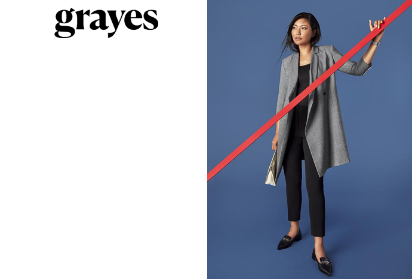
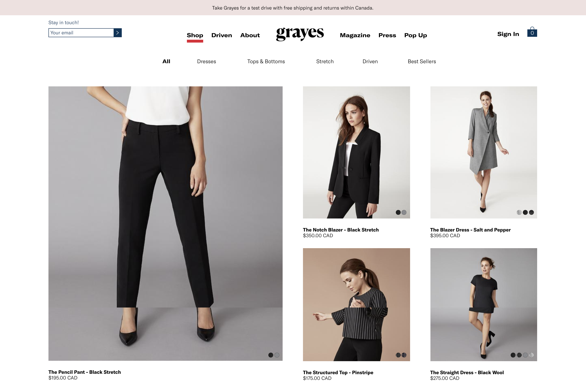
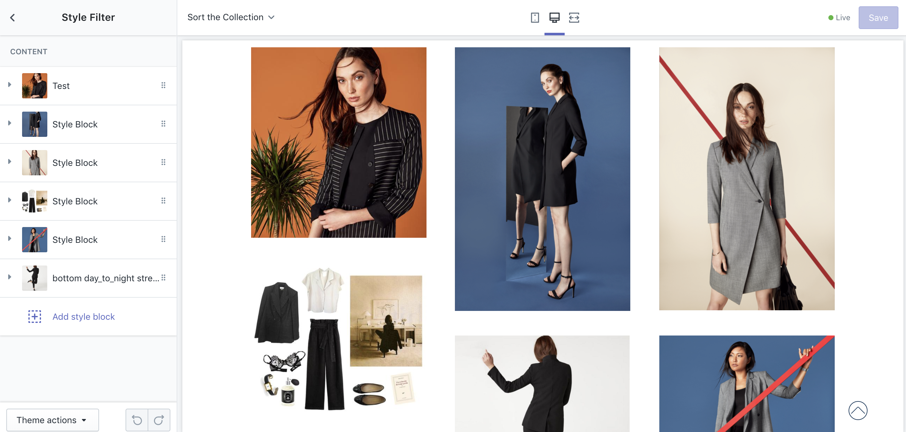
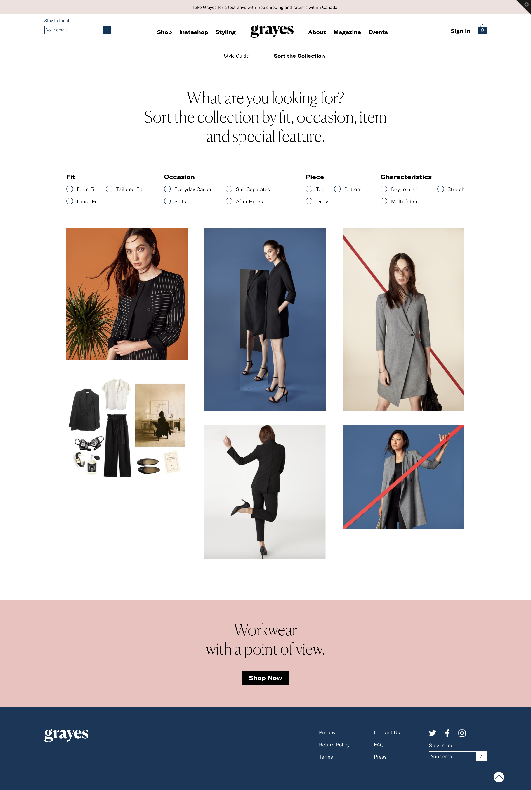
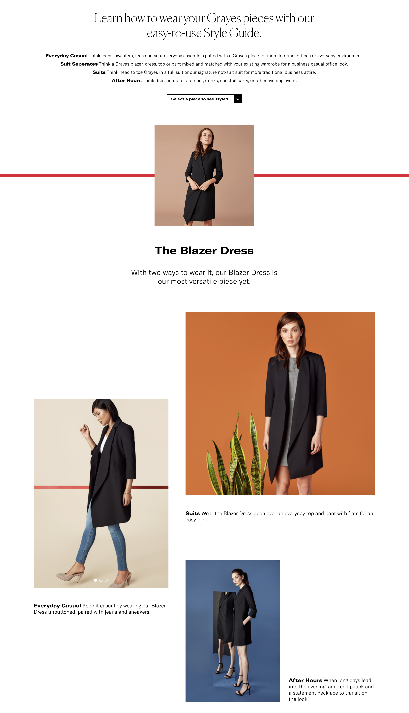
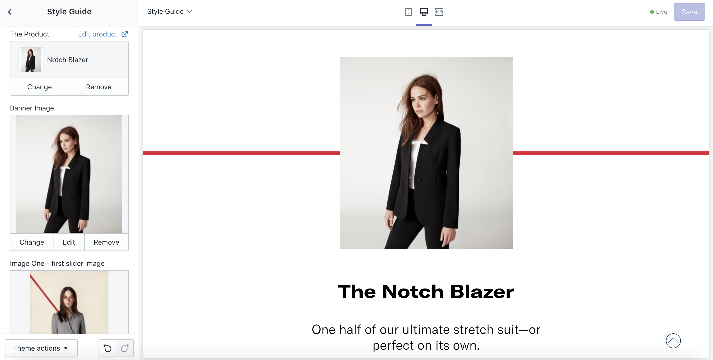

<h3 class="secondary-title case-study">Overview </h3>

Grayes was already an e-commerce business, but wanted to elevate their online space with custom styling, recommendations, and content. Through a highly flexible custom Shopify theme we were able to do just that. 

<h3 class="secondary-title case-study">Technology</h3> 

Shopify

<h3 class="secondary-title case-study">Deliverables</h3>
<ul>
	<li>Custom Shopify Theme</li>
	<li>Customized editable style guide and advance collection display</li>
</ul>

<h3 class="secondary-title case-study">Team</h3>
<ul>
	<li>Trudy MacNabb</li>
	<li>Jordan Deutsch</li>
	<li>
		<a href="http://www.robinhamill.com/" target="_blank">Robin Hamill</a>
	</li> 
	<li>
		Design Partnership
		<a href="http://whitmanemorson.com/" target="_blank">Whitman Emorson</a>
	</li> 
</ul>

 <h3 class="secondary-title case-study">About the Client</h3>

Grayes is a modern online retailer offering a highly curated capsule wardrobe collection for professional women. The company aims to create clothes that represent a modern interpretation of workwear, highlighting the style of the wearer.
 

<h3 class="secondary-title case-study">The Brief</h3>

Grayes was already running their e-commerce business on Shopify and was happy with the inventory management and fulfillment on the platform. As they expanded their collections and the content they wanted to showcase they needed to leverage their Shopify site into a more interactive space. The new website would allow Grayes to create dynamic and versatile style guides, highlight collections with editorial imagery, and recommend products to create cohesive outfits.

<h3 class="secondary-title case-study">The Solution</h3>

The new design integration called for a custom Shopify theme. For the style guide and collection display we toyed with the idea of an embedded Shopify app, but finally landed on leveraging the power of Shopify’s Sections. This allowed us to create a seamless updating and management experience for Grayes, and reduced their overall carrying cost.

<h3 class="secondary-title case-study">The Final Product</h3>

<section class="process">
<h3>The Site</h3>

Grayes went from an online store to an editorial content platform. The final site showcases the products and the women who wear them.

<h3>The Grayes Admin</h3>

Behind the scenes, the Grayes website is as versatile as the clothing.  Custom style guide blocks can be mixed and matched to create editorial spreads. A sortable collection view allows Grayes to display additional media and styling imagery and the custom recommended products elevate the degree of control Grayes has over the product curation.

