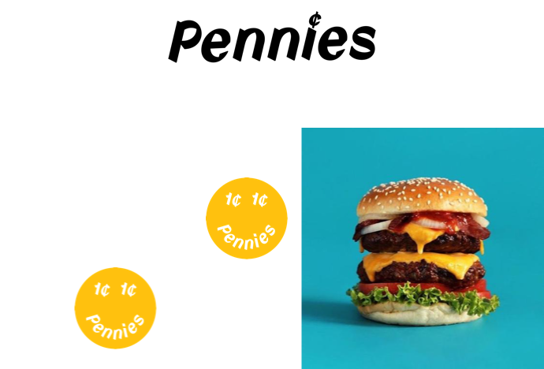
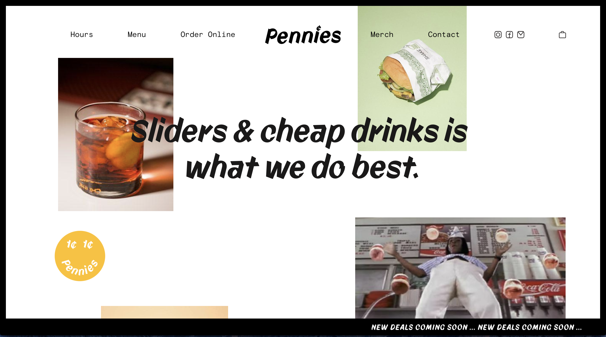
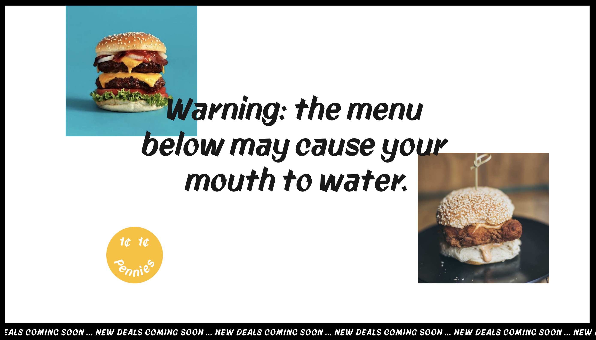
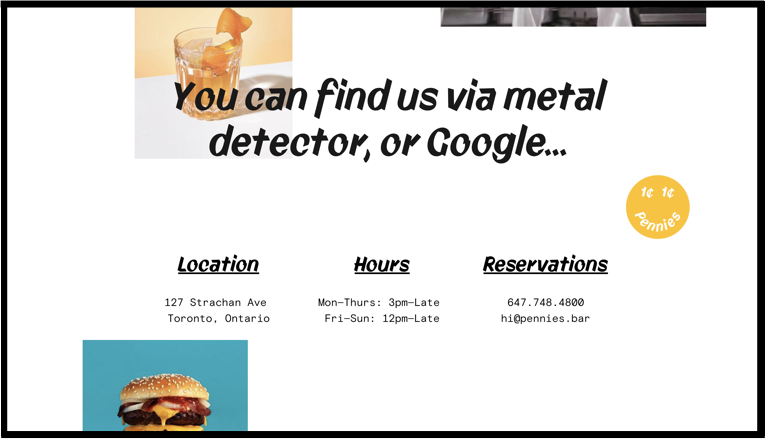
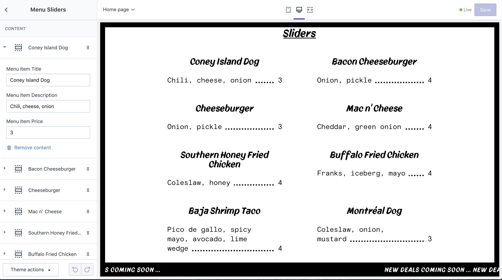

<h3 class="secondary-title case-study">Overview </h3>

Pennies restaurant website went from a multi-page brochure site to a sleek one page interactive e-commerce site.

<h3 class="secondary-title case-study">Technology</h3> 

Shopify

<h3 class="secondary-title case-study">Deliverables</h3>
<ul>
	<li>Custom Shopify Theme</li>
	<li>Customizable callouts and menus for added flexibility</li>
</ul>

<h3 class="secondary-title case-study">Team</h3>
<ul>
	<li>Trudy MacNabb</li>
	<li>Jordan Deutsch</li>
	<li>
		Design Partnership
		<a href="https://designofbrand.com/" target="_blank">Sarah Dobson</a>
	</li> 
</ul>

 <h3 class="secondary-title case-study">About the Client</h3>

Pennies is a bar and restaurant in lively Toronto neighbourhood. The establishment is embedded in a residential street and brings an air of fun and play to the area. 
 

<h3 class="secondary-title case-study">The Brief</h3>

Pennies was undergoing a full rebrand / re-design and needed a website to match their new direction and aesthetic. The goal was to create a site that put pertinent restaurant info (the menu, the hours of operation) at the forefront while also carrying through a sense of fun and play. The new website would include an e-commerce component, integrating the Pennies branding into merchandise that could be purchased online. 

<h3 class="secondary-title case-study">The Solution</h3>

The Pennies website needed to be flexible, easy to edit and manage, and seamlessly integrate e-commerce. To respond to all of these needs we elected to build a custom Shopify theme with a Printful app integration.

The theme leverages Shopify’s Section tool so all of the images and text can be edited by Pennies.

The Printful integration let’s Pennies take their branding assets and easily turn them into hats, t-shirts, and shot glasses.

<h3 class="secondary-title case-study">The Final Product</h3>

<section class="process">
<h3>The Site</h3>

The pennies site has a lot of playful animations and colourful imagery. The menu is prominently featured and new deals can be highlighted in the scrolling ticker.

<h3>The Pennie Admin</h3>

All of the details on the Pennies site can be easily edited, previewed, and updated. New menu items can be added and new products featured without any code making it easy to manage and maintain.

