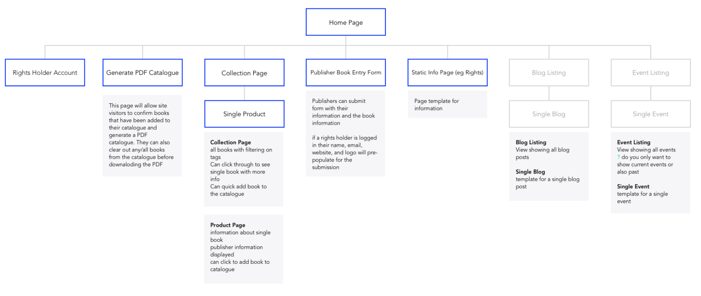

<h3 class="secondary-title case-study">Overview </h3>

Adapting shopify into a collaboration platform for the publishing industry.

<h3 class="secondary-title case-study">Technology</h3> 

Shopify, Custom Web Application (Ruby on Rails)

<h3 class="secondary-title case-study">Deliverables</h3>
<ul>
	<li>Art Direction</li>
	<li>Visual Design</li>
	<liUX></li>
	<li>Back-End Development</li>
	<li>Front-End Development</li>
</ul>

<h3 class="secondary-title case-study">Team</h3>
<ul>
	<li>Trudy MacNabb</li>
	<li>Jordan Deutsch</li>
	<li>Arianne Glavina</li>
</ul>

 <h3 class="secondary-title case-study">About the Client</h3>

The Canada FBM2020 Committee is focused on engaging publishing partners across the country in anticipation of Canada’s honoured role at the 2020 Frankfurt Book Fair. A major goal in creating the Canada FBM2020 publisher platform was ease of use, allowing a diverse range of publishers to participate in title submission.
 

 <h3 class="secondary-title case-study">The Brief</h3>

Create a platform where the CanadaFBM2020 team can easily communicate with the Canadian and German publishing communities. Allow publishers to submit titles with available German publishing rights on the platform. Allow German publishers to easily peruse titles and select some for publishing.

 <h3 class="secondary-title case-study">The Solution</h3>

Leverage the content management system of Shopify to make adding, sorting, and filtering titles seamless. Build a custom web application to extend the functionality of the e-commerce site and allow publishers to submit their own titles for approval and generate and download PDFs of select titles.

<h3 class="secondary-title case-study">Process</h3>

<section class="process">
<h3>Flow Diagrams</h3>

This high level map was used the identify all of the pages of the site. This will help confirm some of the site functionality and will inform the visual design.

<h3>Wireframes</h3>

In this phase low fidelity mock-ups are created to show a visual representation of what content will show up where on the user facing portions of the site. This helps the client start to imagine how a user can interact with information. It also provides a great tool to see any holes in content. Identifying the content structure and layout at this phase helps to maximize the utility of time spent moving forward.

<h3>Designs</h3>

This is when things visually really start to come together. Branding elements are combined with UX to create a full visual design of the final site.

<h3>Development</h3>

Static designs are brought to life and all interactions and functionality are realized. 

